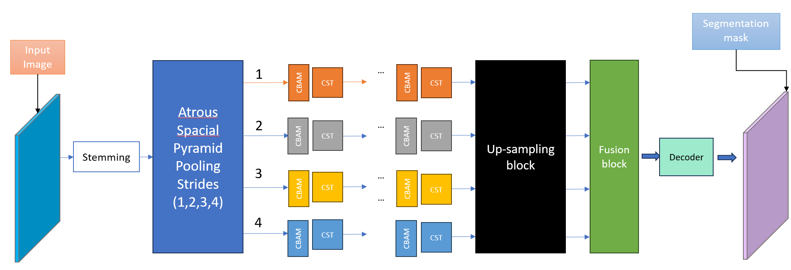

# SegConFormer

This repo contains files and folders for training SegConFormer, a new semantic segmentation architecture for mapping burned areas in satellite images. Additionally, a sample set of the data used in the training is also added. To better recreate the environment in which the models were trained we added the Dokerfile and list of the libraries and packages in requirements.txt

# Description of Content
## The Folders:
- data: Contains a sample of dataset used to train the models
- packages: Contains the different parts of the code
  
## The files:
### The enviroment
- Dockerfile: the structure of the environment in which the model was trained
- requirements: list of dependencies and packages
### The architecture
- segconformer_M12.py: 
- segconformer_M13.py:
### Training 
- segconformer_train.py: the code used for training the model
- exp_parameters_m6.yml: 
- exp_parameters_m9.yml
- exp_parameters_m12.yml
- exp_parameters_m13.yml

### How to train the model
The model can be trained as follows:
python3 /path/to/segconformer_train.py -p /path/to/the/yaml/file/exp_parameters_b1.yml -e exp_number  
